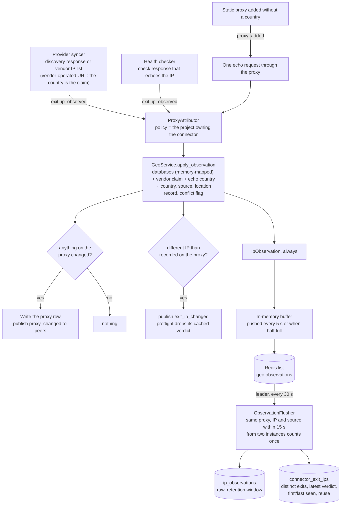
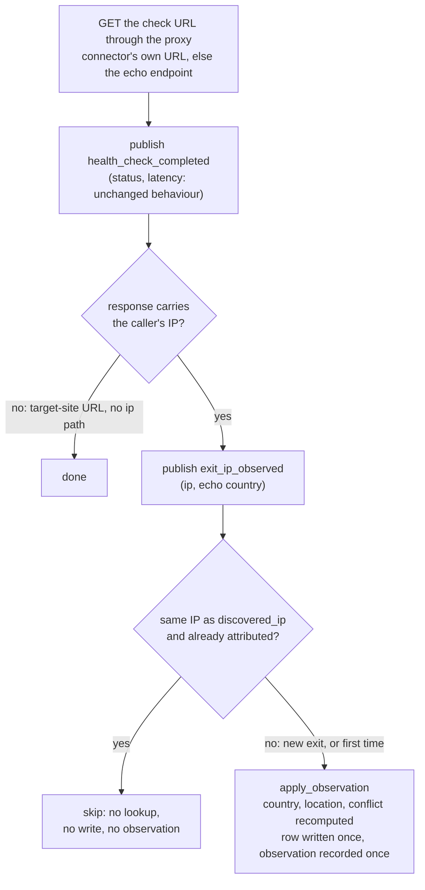
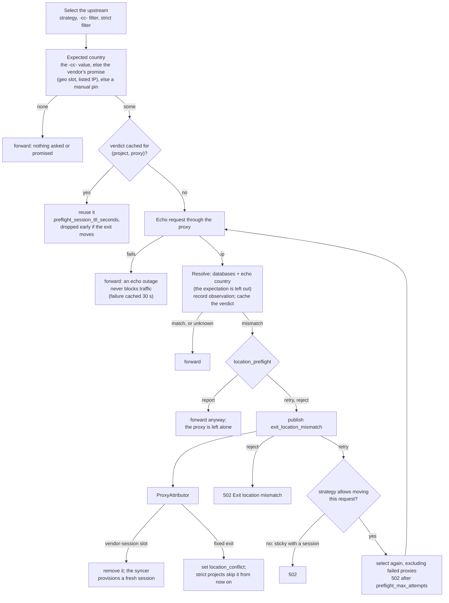
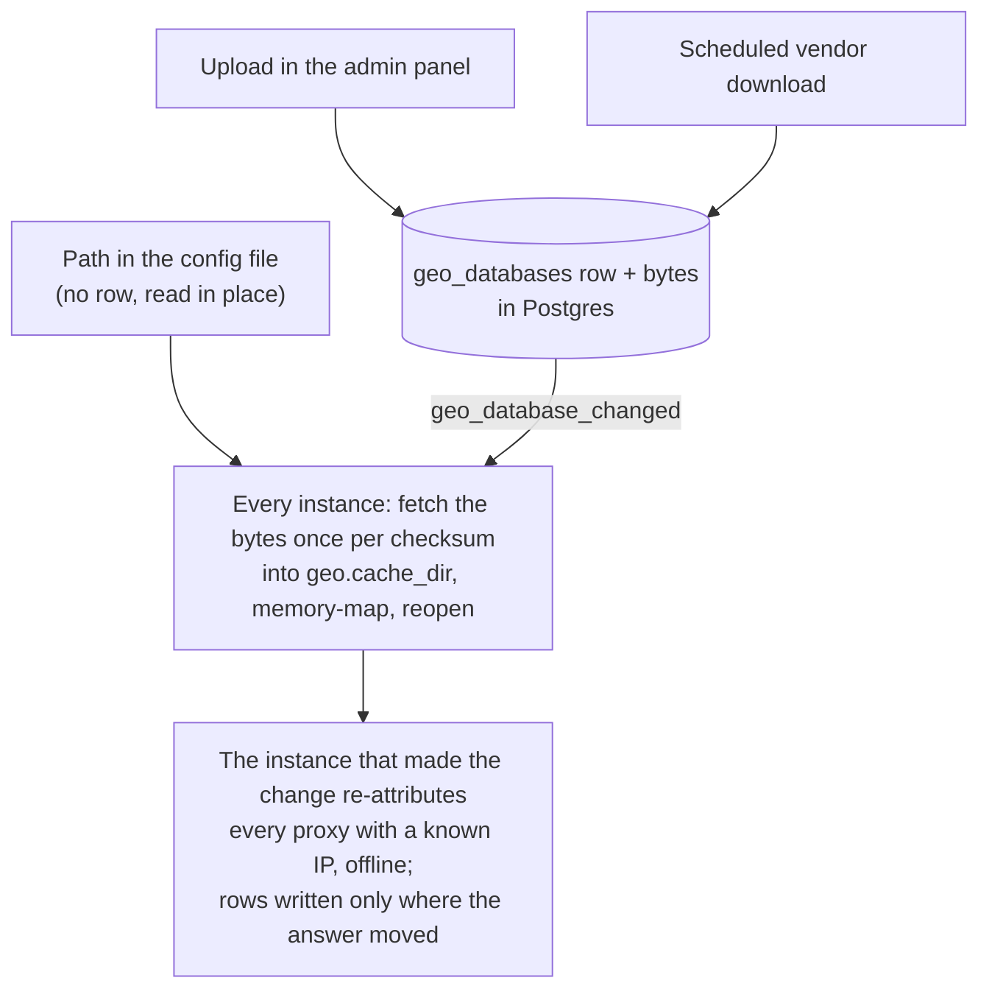

# IP Attribution

<p class="subtitle">Where an exit IP really is, decided from local IP databases, the vendor's own claim and an echo endpoint, and what that says about each provider.</p>

Every proxy Octoprox manages has an exit IP: the address a target site sees. Country routing (`-cc-` username suffix) needs to know which country that IP is in. IP attribution answers that with a small pipeline:

1. **Observe.** Every code path that learns an exit IP produces an *observation*: provider discovery, the exit lookup for manually added proxies, the health checker, the locate button, and the optional preflight check.
2. **Attribute.** The IP is looked up in the IP databases loaded on the instance (MaxMind, DB-IP, IPinfo, IP2Location). Together with the vendor's claim and the echo endpoint's answer, the owning project's *source policy* picks the country and decides whether the vendor's claim is contradicted.
3. **Act.** The resolved country lands on the proxy for routing. A contradicted claim sets a flag that a project's *location policy* may turn into ineligibility. Every observation feeds per-connector accuracy totals.

Nothing on the request path waits for a database: attribution is a memory-mapped lookup, and observations are buffered in memory, batched through Redis and written to Postgres by one leader instance.

## How the pieces fit together

Four flows, drawn separately because they run at different times. The first is the spine every other flow feeds.

### Sightings become attributed proxies



### A health check, every minute, per proxy



So a proxy whose exit never moves costs one lookup and one write in its lifetime. A residential slot costs one per vendor session rotation.

### Preflight, per request, when the project turns it on



### Databases, and what happens when they change



The periodic full reload re-reads the settings row and the database list as a safety net for dropped events; it hashes nothing unless a checksum or a file's size or mtime moved. If the listing itself fails, the databases already open stay open until the next reload rather than being closed on a Postgres blip.

## How exit IPs are learned, per connector type

Attribution never makes requests of its own to find an IP. It listens for *sightings* from the code paths that already learn one, and only then looks the IP up. What produces sightings depends on the connector type:

| Connector / proxy type | How the exit IP is learned | Requests through the proxy | Vendor claim to verify |
|---|---|---|---|
| Residential and mobile sessions (Oxylabs, Bright Data, Decodo, IPRoyal, NetNut) | Never by provisioning: the vendor rotates the exit behind a session and the syncer does not probe it. The health check reports it every minute when the check URL echoes the caller (the attribution echo endpoint by default), and preflight reports it when a project turns preflight on. | Health check: one per proxy per `health_check_interval`, which happens anyway. Preflight: one per (project, proxy) per `preflight_session_ttl_seconds`, or sooner when a health check sees the exit move. | The country the slot was provisioned for, when the connector or a `-cc-` request geo-targeted it. Untargeted slots make no claim. |
| Port-based with IP discovery (Oxylabs ISP and datacenter, Decodo ISP and datacenter) | The syncer requests the **vendor's own** discovery endpoint (named in the descriptor, e.g. `ip.oxylabs.io`, `ip.decodo.com`) through each port when the slot is created, and again on every IP refresh (`ip_refresh_interval`, hourly by default). The response IP and the vendor's country arrive as one sighting. | One discovery request per slot at creation, one per slot per refresh, plus the health check. | The discovery endpoint's country, since the descriptor marks the URL as vendor-operated (`discovery.vendor_operated`, the default). A descriptor pointing discovery at a third-party echo unsets it and the country becomes an `endpoint` candidate instead. With countries listed on the connector, the country the port was kept for. |
| Port-based with a known-IP API (Bright Data ISP and datacenter) | The vendor's IP list gives each slot its IP and country without any request through the proxy; the syncer announces both. Refresh re-reads the list. | Health check only. | The country from the vendor's list. |
| Proxy lists (Webshare) | The list gives host, port and country. The host is normally the exit, but nothing is announced until the first health check reports the caller's IP. | Health check only. | The country from the list. |
| Static connectors (manually added proxies) | One request through the proxy to the echo endpoint when the proxy is added without a country (`proxy.geo_lookup.enabled`), and on the Detect button. Then health checks. | One at creation, one per Detect, plus the health check. | A country set by hand is treated as the claim and kept for routing. |
| Cloud instances (AWS, GCP, Azure) | Health checks only; the instance's public address is the exit. | Health check only. | None. The connector's declared countries list is not a per-proxy claim. |

Two endpoints are therefore in play. Provider descriptors keep the **vendor's discovery endpoint** for port-based IP discovery, at slot creation and on each refresh, because it also returns the vendor's own view of the location. Everything else goes to the **attribution echo endpoint** (`echo_url` in the settings): the health check of every connector that names no check URL of its own, the static-proxy lookup, the Detect button and preflight. A port-based proxy is thus probed by the vendor endpoint hourly and by the echo endpoint every minute, which is the same number of requests as before attribution existed; only the destination of the health check changed from httpbin to the echo. Preflight is a project setting, not a per-connector one: with it on, a request that asks for a country, or that lands on a proxy with a promised or pinned country, is verified against the echo once per project and proxy per cache window, whatever the connector type.

Two consequences worth knowing. A health check sighting is applied only when the IP moved or the proxy was never attributed, so a stable proxy costs one database lookup and one write in its lifetime, not one per minute. And a proxy of a connector with declared countries (static, cloud) that attribution places elsewhere gets that country on its row, which country routing then matches on: the declared list only covers proxies whose own location is unknown.

The **Detect** button on a proxy and **Re-attribute proxies** on the settings page are the manual paths. Re-attribution is offline: it re-runs the databases over every proxy with a known IP and makes no request.

### What each step costs

| Step | When | Cost |
|---|---|---|
| Database lookup | Every sighting that passes the checks above, every preflight check, every re-attribution | Memory-mapped read, microseconds, no I/O |
| Proxy write to Postgres | Only when the resolved country, source, location record, conflict flag or discovered IP changed | One row, then one `proxy_changed` event to peers |
| Observation | Every applied sighting and every preflight check; deduplicated health checks record nothing | Appended to an in-memory buffer; pushed to Redis every `publish_interval_seconds` or as soon as the buffer is half full; written by the leader every `flush_interval_seconds`, which also maintains the accuracy and exit IP aggregates |
| Echo request | Static proxy creation, Detect, preflight (per cache window), and health checks whose URL is the echo endpoint | One HTTP request through the proxy |

## Databases

Any file in MaxMind's mmdb format works, from any vendor. Octoprox reads the file's own metadata to recognise the vendor and normalises each vendor's record layout into one shape (country, region, city, coordinates, ASN, organisation, anonymity flags). IP2Location's BIN format is also supported when the optional `IP2Location` Python package is installed.

| Vendor | Files | Free edition | Notes |
|--------|-------|--------------|-------|
| MaxMind | GeoIP2 / GeoLite2 Country, City, ASN, Anonymous IP (mmdb) | GeoLite2 with a free account and license key | Attribution text required for GeoLite2; redistribution is not permitted, so every install brings its own file |
| DB-IP | Country, City, ASN (mmdb) | Lite editions, CC BY 4.0 | Same layout as MaxMind |
| IPinfo | Country + ASN, Location, Privacy (mmdb) | Country + ASN with a free token | Flat record layout, ASN as `AS12345` |
| IP2Location | DB1 to DB26 (BIN, and mmdb for DB1/DB9), IP2Proxy (BIN) | LITE editions | BIN needs `pip install IP2Location` |

Databases reach an instance three ways:

* **Upload** in Settings → IP attribution. The file is validated by opening it, stored in Postgres, and every instance copies it to its `geo.cache_dir` and memory-maps it. Peers learn about it over the cross-instance event feed.
* **Scheduled download** from the vendor. Register the vendor's download URL with your own credentials (MaxMind account ID and license key as basic auth, an IPinfo token in the URL). The leader instance downloads it now and again every `update_interval_hours`, unpacks `.tar.gz` and `.gz` containers, and publishes the new file only when its checksum changed.
* **Config file** for installs that already run `geoipupdate` on a shared volume: list the paths under `geo.databases`. These are never copied and cannot be removed from the UI.

Databases are consulted in **priority** order, lowest first. The first database with a country answers; the others fill in fields it lacked (a country database plus an ASN database give one merged record). Uploading, enabling, disabling or removing a database re-attributes every proxy with a known exit IP, offline.

Free editions carry a license attribution; the settings page shows it while such a database is loaded.

## Source policy

Three kinds of evidence exist for an exit IP:

* **database**: the loaded IP databases;
* **vendor**: what the proxy vendor claimed (a country in its proxy list or known-IP API, or the country a slot was provisioned for);
* **endpoint**: what the echo endpoint reported when requested through the proxy, for endpoints that know geography.

A source policy is an ordered list of these kinds plus a conflict rule. The first kind with an answer decides the proxy's country. "Database only" is `[database]`, "prefer the vendor, fall back to databases" is `[vendor, database]`, and so on. A kind left out never decides, but still counts as evidence about the vendor.

The install has a default policy (Settings → IP attribution → Policy & echo). Each project may override the source order and the conflict rule on its Location tab; a proxy is always resolved under the policy of the project that owns its connector. None of the kinds costs a request of its own: vendor claims arrive with the vendor's proxy list or slot provisioning, and the echo endpoint is the same request discovery and health checks already make to learn the exit IP.

**Conflict rule** says when a vendor claim counts as contradicted:

* `consensus` (default): every independent source agrees with each other and all of them disagree with the vendor. Databases lag on residential ranges, so a single dissenting database is not evidence against a vendor; independent sources that disagree among themselves mark the observation *uncertain* instead.
* `first`: the top-ranked independent source disagrees with the vendor.

A missing vendor claim never conflicts. A country set by hand on a proxy stays the routing country and is treated as the claim to verify.

## Per-project policy

Each project chooses how strict to be (project settings → Location):

| Setting | Values | Effect |
|---------|--------|--------|
| `location_policy` | `off`, `warn`, `strict` | `strict` makes proxies with a contradicted vendor location ineligible for the project's requests. `warn` only flags them. |
| `location_preflight` | `off`, `report`, `retry`, `reject` | Verify a session's exit before its first request is forwarded (below). |
| `location_sources` | ordered list of `database`, `vendor`, `endpoint`, or null | Which source decides this project's proxies' country; null inherits the install default. |
| `location_conflict_rule` | `consensus`, `first`, or null | When a vendor claim counts as contradicted; null inherits the install default. |

## Preflight

A residential or mobile exit belongs to the session, not to the proxy row, so verifying it means checking the proxy the request was actually routed to. With preflight on, Octoprox makes one echo request through the selected upstream, attributes the IP, and compares it with the country the request *requires*: the `-cc-` country, else the country the vendor promised for the proxy (a geo-targeted slot, a listed IP) or one an operator pinned by hand. A country that was merely observed is not a requirement, so an untargeted residential slot, which may move countries freely, is not preflighted unless the request names a country.

The verdict is cached in Redis per project and proxy for `preflight_session_ttl_seconds` (default 600), so a session pays one extra round trip and the rest of its requests pay nothing. That rests on the assumption that a vendor session keeps its exit for about that long. Vendors do not always oblige: a sticky window may be shorter, or the exit may be replaced after an upstream failure. So the cache is also dropped the moment a health check or an IP refresh sees the proxy exiting from a different address (the `exit_ip_changed` signal), and the next request through that proxy is verified again. The window during which a rotated exit is trusted unverified is therefore at most one `health_check_interval`, not the whole TTL. Lower the TTL for a tighter bound at the cost of one echo request per proxy per TTL.

* `report` records the observation and forwards the request regardless.
* `retry` re-selects among the project's remaining eligible proxies on a mismatch, up to `preflight_max_attempts` proxies, then answers 502. Whether a request may move is the routing strategy's call: under `sticky` a request with a session was promised one exit, so a mismatch fails it instead of moving it; the other strategies allow the move.
* `reject` answers `502 Bad Gateway` with `Exit location mismatch: requested GB, observed US (…)` on the first mismatch.

Under `retry` and `reject` a mismatch also acts on the proxy. A vendor-session slot (residential, mobile) is rotated: removed, so the provider sync provisions a fresh session in its place. A fixed exit (static, port-mode, ISP) is flagged as contradicted, so `strict` projects skip it on later selections without another echo request, and the cached verdict lets `retry` pass over it quickly.

An unreachable echo endpoint or an IP no source knows never blocks traffic: preflight only rejects a confirmed mismatch. Rotating pools without a session id cannot be gated this way; their observations still feed provider accuracy.

## Provider accuracy

Every observation records what the vendor claimed and what attribution resolved, and the exit IP table keeps the latest of those per distinct exit. Provider accuracy is computed from that table: of a connector's distinct exits last seen in the window, how many carried a vendor claim, and how many of those the latest verdict confirms, contradicts or leaves uncertain. Each IP counts once however often it was seen, so a restart, an hourly refresh or a re-attribution does not inflate the numbers, and a re-attribution after a database change rewrites the verdicts rather than adding to a frozen history. For a residential pool that hands out a fresh IP per session this is one judgement per exit; for pools that reuse exits a wrong IP counts once, not once per hand-out. Every user sees it for the current project under **Exit locations** in the project menu; admins see all projects, with a project filter, under Settings → IP attribution. The connector inspector shows the connector's own numbers.

Rates below 100% are normal for residential pools whose ranges databases have not caught up with. A rate that keeps falling, or one vendor far below the others, is a vendor problem.

## Unique exits per connector

Every observation also feeds `connector_exit_ips`: one row per connector and distinct exit IP, with when it was first and last seen, how many times it was newly handed out, and the state of its latest observation: the proxy that held it, how it was seen, what the vendor claimed, what attribution resolved and the verdict. That state is stored on the row so the view is one indexed table rather than a join into the raw history, and it is refreshed by every observation, including re-attribution and preflight, while only hand-outs move the count. The flusher upserts it in the same batch as the accuracy aggregates, and it is kept until `exit_ip_retention_days` after the IP was last seen (forever by default), so "how many distinct exits has this pool ever given us" survives the raw observation window. Both aggregates are deleted with their connector; the raw observations are not, so what a removed connector did stays visible until retention.

Exit locations has three tabs built on this. **Provider accuracy** shows, per connector, the distinct exits first seen in the window and ever, and the share of IPs handed out more than once. **Exit IPs** lists the distinct exits themselves with their latest state, one row per connector and IP, filtered and paged on the server. **Observation log** is the raw history, one row per sighting, which grows with every restart and IP change and follows the observation retention. Admins see the same three under Settings → IP attribution. `GET /geo/exits` returns the summary and `GET /geo/exits/ips` the paged exit list.

`sightings` counts hand-outs: a sighting is counted only when the IP differs from the one recorded on the proxy, or the proxy had never been attributed. When two instances briefly own the same proxy during a membership change and both report the same exit, the flusher counts that once for the aggregates and keeps both raw rows. Re-attribution, the Detect button on an unchanged proxy and preflight all record observations, but they verify an exit the proxy already had and do not count. Unchanged health checks are skipped altogether. So the number is how many times the connector gave that IP to a proxy, not how many minutes it was in use. A residential pool that keeps returning the same few thousand exits shows a high reuse share; one drawing on millions shows a low one.

## Echo endpoint

Every Octoprox instance serves `GET /echo`, unauthenticated, returning the caller's IP as JSON plus the attribution from the loaded databases:

```json
{"ip": "203.0.113.7", "country": "GB", "city": "London", "asn": 12345, "organization": "Example Ltd", "databases": ["…"], "timestamp": "…"}
```

Requested through a proxy it returns the proxy's exit. The settings' `echo_url` is what the static-proxy lookup, the Detect button, preflight and, when a connector names no check URL of its own, the health checker request. The fresh-install default is `https://httpbin.org/ip`, which returns the IP and nothing else to every caller; set `echo_url` to a publicly reachable Octoprox instance and those requests stop depending on a third party. Provider descriptors keep their vendor-specific discovery endpoints for port-based IP discovery, since those also return the vendor's own view of the location.

The request travels out through the vendor's proxy and back in from the public internet, so the endpoint must be reachable from there. Installs on a private network run the standalone echo service on a public host instead:

```bash
OCTOPROX_ECHO_DATABASES=/data/GeoLite2-City.mmdb octoprox-echo   # same image, listens on :8090
```

Behind a load balancer the peer address is the balancer's, so list its addresses in `geo.echo.trusted_proxies` (or `OCTOPROX_ECHO_TRUSTED_PROXIES` for the standalone service) and the client IP is read from `X-Forwarded-For`. The bundled HAProxy config sets that header on the API frontend.

## Health checks

Connectors that name no check URL are checked against the echo endpoint, so every check already sees the exit IP; Octoprox reads it and re-attributes the proxy when the IP changed, with no extra request. Connectors whose check URL is a target site rather than an echo endpoint report no IP. For a custom echo-style URL set `healthcheck_ip_path` (and optionally `healthcheck_country_path`) in the connector config to the JMESPath of the address in the response, or `@text` for a plain-text body; the httpbin `origin` layout is recognised without configuration.

## What is stored on a proxy

| Metadata key | Meaning |
|--------------|---------|
| `country` | The resolved country routing reads |
| `country_source` | `database`, `vendor`, `endpoint` or `manual` |
| `vendor_country` | What the vendor claimed |
| `endpoint_country` | What a third-party discovery endpoint or the echo reported; a vendor-operated discovery URL writes `vendor_country` instead |
| `location` | Full record from the databases: region, city, coordinates, ASN, anonymity flags |
| `location_conflict` | The vendor's claim is contradicted under the conflict rule |
| `location_candidates` | Each source's answer, for the inspector |

Only `country` takes part in routing today; the rest is stored so region- or city-level routing can be added without another lookup.

## Backup and restore

The admin backup (Settings > Backup) always carries the attribution settings
row and the database records. The two optional boxes decide the rest:

| Backup option | What it adds |
|---------------|--------------|
| Include history | Raw exit IP observations and the per-connector exit IPs with their latest verdicts, alongside proxy and project metrics. |
| Include IP database files | The bytes of every uploaded or downloaded database. Off by default because a city database is tens of megabytes. |

A restore without the files keeps the records, so the databases list shows
each one without a file and with a load error until it is re-uploaded, or
refreshed when it has an update URL. Operator-managed files from the config
are not part of the backup at all; they live on disk next to the instance.

## Configuration

```yaml
geo:
  cache_dir: data/geo                 # where this instance caches stored database files
  databases:                          # operator-managed files (optional)
    - path: /etc/octoprox/GeoLite2-City.mmdb
      priority: 10
  defaults:                           # settings of a fresh install; the admin panel edits the live row
    default_sources: [database, vendor, endpoint]
    default_conflict_rule: consensus
    echo_url: https://proxy.example.com/echo
    preflight_max_attempts: 3
  echo:
    enabled: true
    trusted_proxies: [10.0.0.0/8]
  observations:
    publish_interval_seconds: 5
    flush_interval_seconds: 30
    max_buffer: 5000
  updater:
    check_interval_seconds: 3600
```

The older `proxy.geo_lookup` settings still seed the echo endpoint of a fresh install, so existing installs keep their endpoint until an admin saves the settings.

## API

See the [API reference]({{ site.baseurl }}/api#ip-attribution) for the `/api/v1/geo` endpoints: settings, databases, lookup, re-attribution, observations, accuracy and status.
