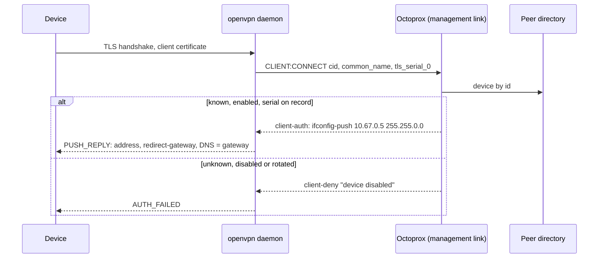

# OpenVPN Devices

<p class="subtitle">The second tunnel devices can join a project's pool through: for routers and older devices without WireGuard, and for networks where only TCP gets out.</p>

Everything [WireGuard Devices](wireguard) says about what happens inside a tunnel applies here unchanged. A device connects to an OpenVPN endpoint Octoprox runs, and from there on its traffic is handled by the same data plane: names resolve to synthetic addresses at the tunnel gateway, every TCP connection is redirected into the project's proxy path, and the device's requests are routed, filtered, metered and verified like a proxy client's. What differs is the tunnel itself: how the endpoint runs, how a device proves who it is, and what it imports.

Pick OpenVPN over WireGuard when:

- the device or router has an OpenVPN client but no WireGuard one (many consumer routers, NAS boxes, older set-top boxes);
- the device sits behind a network that blocks UDP, and the endpoint can be run over TCP on port 443;
- an operator's tooling already deals in `.ovpn` profiles.

Pick WireGuard otherwise: it is lighter, reconnects faster, and its config fits in a QR code.

## How it works

### Identity: a private CA instead of a key pair

OpenVPN authenticates with X.509. On first start Octoprox generates a private certificate authority for the install, a server certificate signed by it, and a tls-crypt key, and stores all three in Postgres (`openvpn_settings`, one row) so every instance presents the same identity, as with the WireGuard key pair. The CA is separate from the MITM CA and is trusted by devices for the tunnel endpoint only.

Each device gets a certificate issued by that CA with the device's id as common name, and the private key is kept so the profile can be shown again. There is no bring-your-own certificate and no revocation list: whether a connecting device is let in is decided against the device directory at connect time, not by the certificate alone.

### Admission: the directory decides, per connection

The daemon is started with `management-client-auth`, which holds every connecting device until Octoprox answers over the daemon's management socket. Octoprox looks the device up by common name and checks three things: the device exists, it is enabled, and the serial of the certificate it presented is the one on record. A device that passes is admitted and pushed its fixed tunnel address (`ifconfig-push`); one that fails is refused with the reason in the log and counted on the settings page.

That makes the tunnel address the credential, exactly as for WireGuard: the daemon drops packets a device sends from any address but the one it was pushed, so the address a connection arrives from names the device, and through it the project and the routing it was given.

Disabling a device, rotating its certificate or removing it ends any session it has at once (on every instance carrying one), and the next connection attempt is refused. Rotating the install's identity reissues every device under the new CA in one transaction and restarts the daemons; every profile has to be loaded again.



### The daemon

Where WireGuard is an interface the kernel keeps, OpenVPN is a process. On every instance where `openvpn.enabled` is set, Octoprox writes the daemon's configuration (identity included) into a private temporary directory, starts `openvpn` with the same ambient capabilities the other tunnel tools get, connects to its management socket, waits for the tun interface to come up, and attaches that interface to the shared data plane. If the daemon exits on its own it is started again with backoff (five seconds, doubling to a minute), and the settings page shows the exit status with the daemon's last lines of output. A failure to start never takes the proxy ports down.

The daemon's configuration, in short: `server <subnet>` in `topology subnet`, one transport (`proto udp` or `proto tcp-server`) on the install's port, `push "redirect-gateway def1"` and `push "dhcp-option DNS <gateway>"`, `remote-cert-tls client`, `dh none` (elliptic-curve key exchange), modern AEAD data ciphers, `tls-crypt` with the install's key, and the management socket. Devices get `remote-cert-tls server` in their profile, which pins the endpoint to a server certificate of the install's CA.

### What a device imports

One `.ovpn` file with the CA, the device's certificate and key, and the tls-crypt key inline. OpenVPN Connect on iOS, Android, macOS and Windows imports it, and so do OpenWrt, pfSense, ASUS, Synology and most other routers with an OpenVPN client. There is no QR code: the profile is far too large for one.

## Enabling the endpoint

The management side (settings, devices, profiles) runs on every instance with no extra requirements. The daemon runs on every instance where `openvpn.enabled` is set: one instance in the single-instance setup, every replica in the bundled cluster. Each such instance needs:

- **CAP_NET_ADMIN** and **`/dev/net/tun`**, both always: OpenVPN runs in userspace and creates its own tun interface. The image installs `openvpn`, `iproute2` and `nftables`, and gives `setpriv` the capability as a file capability; the container still has to be granted the capability and the device.
- **The port published**, 1194 by default, over the transport the install's settings name (UDP unless set to TCP).

The cluster compose files do all of this on every replica and publish 1194 over both UDP and TCP through nginx; the daemons listen on whichever transport the settings name. For the single-instance files, uncomment the prepared lines in `docker-compose.yml` or `docker-compose.ghcr.yml`:

```yaml
    ports:
      - "1194:1194/udp"
    cap_add:
      - NET_ADMIN
    devices:
      - /dev/net/tun:/dev/net/tun
    environment:
      - OCTOPROX_OPENVPN_ENABLED=true
```

Then, as an admin, open **Settings → OpenVPN** and set the **public endpoint host**. The page also shows whether the answering instance is running the daemon, its version, how often it was restarted, and the error if it failed to come up.

### Process settings

In `config/*.yaml` under `openvpn:` or as `OCTOPROX_OPENVPN_*` environment variables:

| Setting | Default | Meaning |
|---------|---------|---------|
| `enabled` | `false` | Run the daemon on this instance. |
| `interface` | `ovpn0` | Name of the tun interface the daemon creates. |
| `listen_port` | endpoint port | Override the port this instance binds when a port-mapping NAT sits in front of it. |
| `mtu` | `1500` | `tun-mtu` of the daemon's interface. |
| `defaults` | | Seed for the install-wide row on a fresh install: `endpoint_host`, `endpoint_port`, `protocol`, `subnet`, `keepalive_interval`, `keepalive_timeout`, `client_mtu`. |

The data plane's own settings (`tunnel:`) are shared with WireGuard and described in [WireGuard Devices](wireguard#process-settings).

### Install-wide settings

Edited under **Settings → OpenVPN** and stored in Postgres so every instance agrees on them:

| Setting | Default | Meaning |
|---------|---------|---------|
| Public endpoint host | empty | The `remote` host in every device profile. |
| Port | `1194` | The `remote` port, and what every daemon listens on unless its `listen_port` overrides it. |
| Transport | UDP | UDP or TCP. One per install: the daemon listens on it, every profile names it. Changing it restarts the daemons. |
| Tunnel subnet | `10.67.0.0/16` | Devices get addresses from it; the first host is the gateway and the tunnel's DNS. Must not overlap the WireGuard subnet. Changing it requires removing every device first and restarts the daemons. |
| Keepalive | `10` / `60` | Seconds between pings, and seconds without one before a side gives up. |
| Device MTU | unset | Written into device profiles as `tun-mtu` when set. |
| Identity | generated | The CA, server certificate and tls-crypt key. **Rotate identity** replaces all three and reissues every device. |

## Adding a device

Devices belong to a project. Under the project's **Devices** page, **Add device**, pick **OpenVPN** as the tunnel:

- **Name** it after the thing it is.
- **Routing.** What a proxy client would put in its username ([session IDs and per-request targeting](routing-strategies#session-ids)): a fixed **sticky session**, and an **exit country**, optionally narrowed to a **state** and **city**. Leave them empty to route with the project's defaults.

The device gets a certificate from the install's CA and the next free address of the subnet. Open it to download or copy its `.ovpn` profile. Each device's row shows whether it is **online** (the daemon on some instance carries a session for it), since when, from where, and the session's byte counters; its relayed traffic and name-resolution signals are the same metrics WireGuard devices have.

**Disable** refuses the device at the next connection and drops its current session; the profile stays valid. **Rotate certificate** issues a new one and does the same; the old profile stops working. **Remove** frees the address. Deleting a project removes its devices.

## In a cluster

Every replica runs the daemon with the same CA and device list, and nginx pins a device to one replica by source address, over UDP or TCP. A device rehashed to another replica reconnects there and is admitted the same way. The fake-IP mapping is shared through Redis, so a connection that lands on a different replica from the one that answered the device's DNS query still knows the name. Each carrying replica publishes the sessions it holds to Redis and the views merge them.

## Limitations

- **One transport per install.** The daemon cannot listen on UDP and TCP at once; choose per install, and run two installs if you need both.
- **IPv4 inside the tunnel.** The profile does not push an IPv6 route, so a device with native IPv6 can still reach an IPv6-only literal address outside the tunnel. Names never take that path: the tunnel resolver answers no AAAA records. WireGuard profiles route `::/0` into the tunnel; OpenVPN would need an IPv6 address on the tun interface for that, which Docker containers rarely have.
- Everything under [WireGuard Devices, Limitations](wireguard#limitations): TCP only through the pool, names recovered from the stream for literal addresses, MITM as on the proxy port, backups carrying the identity and device keys.

## API

See the [API reference](api#openvpn) for the settings and device endpoints.
