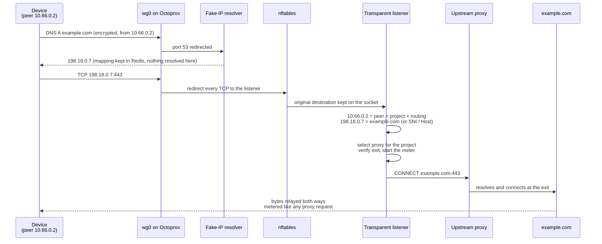
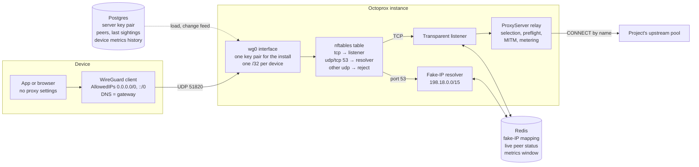
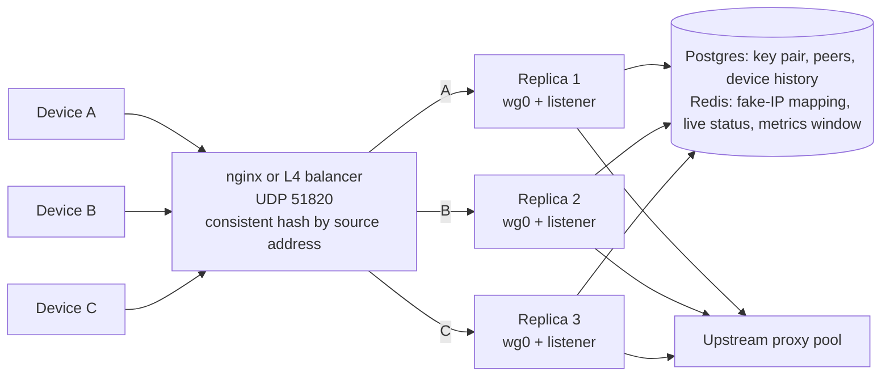

# WireGuard Devices

<p class="subtitle">Routers, TVs, consoles, phones: anything that cannot be pointed at a proxy becomes a client of the pool by connecting to a WireGuard tunnel that Octoprox terminates.</p>

A proxy manager that can only be used from a browser or `curl` stops at the edge of the device world. Many of the things people most want to route through a residential or geo-targeted exit have no proxy setting at all: a smart TV, a streaming stick, a game console, a camera, a whole home router. WireGuard is the one tunnel protocol all of those speak (natively or through a cheap router), and the WireGuard app is on every phone store.

Octoprox runs a WireGuard endpoint. A device connects to it, and everything the device sends is routed exactly as if it had authenticated to the proxy port with the project's credentials: the project's connectors, routing strategy, domain filters, traffic limits, exit verification and metrics all apply. Nothing on the device knows a proxy is involved.

## How it works

### One connection, from the device to the exit



### What runs where



1. **The tunnel address is the credential.** Each device is a *peer* with its own key pair and a `/32` address from the tunnel subnet. WireGuard's cryptokey routing only delivers packets whose source address belongs to the sending peer, so the address a connection arrives from identifies the device, and through it the project and the routing it was given.
2. **Names resolve at the exit, exactly as on the proxy port.** A proxy client hands Octoprox the hostname in its request and the upstream resolves it; a device with no proxy configured resolves names itself before connecting, so something has to answer its DNS or the name is gone before we see the connection. Device configs point DNS at the tunnel gateway, and port 53 inside the tunnel is redirected there whatever the device had configured. The resolver answers every name with a synthetic address from a reserved range (`198.18.0.0/15`, the fake-IP pattern) and remembers the mapping, without forwarding the query anywhere. The name then travels to the upstream in the CONNECT, as it does for a proxy client, so no path resolves targets on the Octoprox host. `AAAA` answers are empty, which keeps devices on IPv4 inside the tunnel.
3. **Every TCP connection becomes a CONNECT.** nftables redirects all TCP leaving the tunnel to a local transparent listener. The listener reads the original destination back from the socket, turns a fake address into its name (or, for a literal address the device had from elsewhere, reads the name from the TLS ClientHello or the HTTP `Host` header), selects an upstream proxy for the peer's project, and relays bytes. Only the proxy pool is reachable through the tunnel; nothing is forwarded.
4. **UDP other than DNS is rejected**, not dropped. The ICMP unreachable makes a browser's QUIC attempt fail immediately and fall back to TCP instead of waiting out a timeout.

The same code paths serve the proxy port and the tunnel: proxy selection, exit preflight, traffic metering, the MITM handler (when the project has interception on and the connection is TLS) and the completion events that feed the metrics. A device's traffic shows up in the project's and connectors' counters like any other, and in the device's own: every connection is also metered against the device it came from, so each device has the same history a connector has (see [Metrics]({{ site.baseurl }}/metrics)).

## Enabling the endpoint

The management side (settings, peers, configs) runs on every instance with no extra requirements. The tunnel itself comes up on every instance where `wireguard.enabled` is set: one instance in the single-instance setup, every replica in the bundled cluster. Each such instance needs:

- **CAP_NET_ADMIN**, to create the interface and the nftables table. The image installs `iproute2`, `wireguard-tools`, `nftables` and `wireguard-go`, and gives `setpriv` the capability as a file capability; the process stays unprivileged and launches the tools through `setpriv`, which hands the capability on. The container still has to be granted the capability.
- **A WireGuard implementation.** Any Linux 5.6 or later kernel has one built in and the container can use it. Where the host kernel has none, Octoprox falls back to `wireguard-go` in userspace, which needs `/dev/net/tun` passed into the container. Docker Desktop's Linux VM has the kernel implementation, so a cluster on a Mac or Windows machine runs it natively; some NAS boxes and older kernels fall back to userspace, with the same behaviour and a little more CPU per tunnel.
- **The UDP port published**, 51820 by default.

The cluster compose files (`docker-compose.cluster.yml`, `docker-compose.cluster.ghcr.yml`) already do all of this on every replica and publish the UDP port through nginx. For the single-instance files, uncomment the prepared lines in `docker-compose.yml` or `docker-compose.ghcr.yml`:

```yaml
    ports:
      - "51820:51820/udp"
    cap_add:
      - NET_ADMIN
    devices:
      - /dev/net/tun:/dev/net/tun   # only for the wireguard-go fallback
    environment:
      - OCTOPROX_WIREGUARD_ENABLED=true
```

Then, as an admin, open **Settings → WireGuard** and set the **public endpoint host**: the hostname or IP devices will reach the tunnel at (the balancer in a cluster, the instance itself otherwise). Device configs cannot be completed before this is set. The page also shows whether the answering instance is terminating the tunnel, with which backend (kernel or userspace), and the error if it failed to come up. A failure here never takes the proxy ports down; the page says what is missing.

### Process settings

The WireGuard side, in `config/*.yaml` under `wireguard:` or as `OCTOPROX_WIREGUARD_*` environment variables:

| Setting | Default | Meaning |
|---------|---------|---------|
| `enabled` | `false` | Terminate the tunnel on this instance. |
| `interface` | `wg0` | Name of the interface this instance creates. |
| `listen_port` | endpoint port | Override the UDP port this instance binds when a port-mapping NAT sits in front of it. |
| `mtu` | `1420` | MTU of the interface. |
| `defaults` | | Seed for the install-wide row on a fresh install: `endpoint_host`, `endpoint_port`, `subnet`, `persistent_keepalive`, `client_mtu`. |

What happens to traffic once it is inside a tunnel does not depend on the tunnel protocol, and its settings sit under `tunnel:` (or `OCTOPROX_TUNNEL_*`):

| Setting | Default | Meaning |
|---------|---------|---------|
| `transparent_port` | `8081` | Local TCP port tunnel connections are redirected to. Bound on the tunnel gateway addresses only. |
| `dns_port` | `5353` | Local port of the fake-IP resolver. Port 53 inside a tunnel is redirected to it. |
| `fake_ip_range` | `198.18.0.0/15` | Range the resolver answers from. |
| `sniff_timeout_seconds` | `2` | How long a connection's first bytes are awaited before it is routed by address alone (server-speaks-first protocols pay this once). |
| `block_encrypted_dns` | `true` | Close connections to DNS over TLS (port 853) and known DNS-over-HTTPS resolvers so devices keep the tunnel resolver (see Encrypted DNS on devices). |

### Install-wide settings

Edited under **Settings → WireGuard** and stored in Postgres so every instance agrees on them:

| Setting | Default | Meaning |
|---------|---------|---------|
| Public endpoint host | empty | The `Endpoint` host in every device config. |
| UDP port | `51820` | The `Endpoint` port, and what every terminating instance listens on unless its `listen_port` overrides it. |
| Tunnel subnet | `10.66.0.0/16` | Devices get addresses from it; the first host is the gateway and the tunnel's DNS. Changing it requires removing every device first and restarting the terminating instances. |
| Persistent keepalive | `25` | Seconds between keepalives devices send, so NATs in front of them keep the mapping. |
| Device MTU | unset | Written into device configs when set. |
| Server key pair | generated | One pair for the whole install. **Rotate key** replaces it; every device then needs a new config. |

## Adding a device

Devices belong to a project. Under the project's **WireGuard devices** page, **Add device**:

- **Name** it after the thing it is ("Living room TV").
- **Keys.** By default Octoprox generates the key pair and keeps the private key, so the config and QR code can be shown again later. Untick *Generate keys for me* to register a public key the device already holds; the config then carries a placeholder where the private key goes, and no QR code is offered because it would be incomplete. A **preshared key** is added by default.
- **Routing.** What a proxy client would put in its username ([session IDs and per-request targeting](routing-strategies#session-ids)): a fixed **sticky session** so a device keeps one exit with sticky or dynamic-sessions connectors, and an **exit country**, optionally narrowed to a **state** and **city**. Leave them empty to route with the project's defaults.

The device gets the next free address of the subnet. Open it to see its configuration:

- **Phones and tablets:** scan the QR code from the WireGuard app.
- **Routers, TVs, computers:** download the `.conf` file or copy the text. The file name is a valid `wg-quick` interface name.

The config sends everything into the tunnel (`AllowedIPs = 0.0.0.0/0, ::/0`) and uses the gateway as DNS. Both are required for the scheme above to work; a split tunnel that routes only some destinations through WireGuard would still send all DNS to the gateway and get fake addresses for names it then tries to reach directly.

### What a device shows

Each device's row shows whether it is **online** (a handshake within the last three minutes), when it last handshaked and from where, and how much traffic the pool has relayed for it. Two different things are behind those numbers:

- **Where the device stands** comes from the WireGuard interface on the instance carrying its session. Every carrying instance publishes what its interface knows to Redis every ten seconds and the views merge them, so the status is right whichever instance answers and when several instances carry sessions. A handshake newer than the device's row knows is also written to the row, so when a device was last seen, and from where, survives the carrying instance restarting (its interface starts from zero) and is there when nothing is carrying the device at all; the device panel says *on record* when that is what it is showing. The interface's own byte counters (wire bytes, handshakes and DNS included) are shown while an instance carries the device, labelled as such.
- **What the device's traffic amounted to** is metered on the proxy path: every connection a device opens is counted against the device as well as against the proxy, the connector and the project, with the same completion events, the same bytes-as-they-flow metering and the same history pipeline. Each device has totals (connections, bytes up and down, success rate, time to connect) that are cluster-wide and survive restarts, and a history at the same ranges and compaction tiers as a connector's, charted in the device panel and served by `GET /projects/{id}/wireguard/peers/{id}/metrics/history`. Removing a device removes its history; a project's retention applies to its devices' history as to the rest.

### Disabling, rotating, removing

- **Disable** keeps the device's config valid but refuses it at the tunnel; it drops out of the interface's peer list within a second.
- **Rotate keys** issues a new pair (and preshared key); the old config stops working until the new one is loaded.
- **Remove** frees the address. Deleting a project removes its devices.

Changes reach every terminating instance through the same cross-instance change feed the proxy caches use, with the periodic full reload as the safety net.

## Encrypted DNS on devices

The scheme above depends on the device asking the tunnel resolver. A device that resolves names elsewhere, over DNS over HTTPS or DNS over TLS, still cannot leave the tunnel (every TCP connection is redirected and UDP other than port 53 is rejected), but its connections then carry real addresses, and the name is recovered only when the stream repeats it: the TLS SNI or an HTTP `Host` header, which covers browsers and almost every app. A protocol that carries no name is relayed by address, so domain filters see an address and the exit may differ from the one that resolved it. Nothing errors, so Octoprox does three things about it:

- **Firefox's canary.** Firefox asks the network resolver for `use-application-dns.net` before enabling DoH and keeps plain DNS when the answer is NXDOMAIN. The tunnel resolver answers it that way.
- **Encrypted resolvers are closed** (`tunnel.block_encrypted_dns`, on by default): connections to port 853 and to the well-known public DoH resolvers (Google, Cloudflare, Quad9, NextDNS, AdGuard, OpenDNS and others) are closed instead of relayed, so a client in automatic mode falls back to the tunnel resolver. Chrome only upgrades to DoH when the system resolver is a known public one, which the tunnel gateway is not. Android's automatic Private DNS probes the gateway for DoT, finds none and uses plain DNS. A device with an **explicit** Private DNS hostname is the case this cannot fix: with port 853 closed it has no DNS at all. Set Private DNS to automatic or off on tunnel devices, or turn the block off.
- **The degradation is counted.** Each device shows how many of its connections were routed by address and how many encrypted-DNS connections were closed. Both ride the device's metrics: they are cluster-wide, survive restarts and have history (the device's chart can show them per interval), and the WireGuard settings page shows the totals over every device. A device with a growing "routed by address" number is resolving somewhere else, or speaking a protocol without a name.

## In a cluster

Every replica terminates the tunnel. The balancer pins a device to one
replica by source address; the key pair, peer list and fake-IP mapping
are install-wide, so a device that is rehashed re-handshakes on another
replica and its connections resolve there too.



## Limitations

- **TCP only.** UDP other than DNS is rejected inside the tunnel. QUIC falls back to TCP on its own; a UDP-only application (some games, VoIP) does not work through the pool, because the upstream proxy protocols Octoprox speaks carry TCP.
- **IPv4 inside the tunnel.** Device configs route `::/0` so nothing leaks around the tunnel, but with empty `AAAA` answers devices use IPv4 for everything.
- **Clustering.** The bundled cluster compose fronts the replicas with nginx, which forwards the UDP port with consistent hashing by source address, and every replica terminates the tunnel. The key pair, peer list and fake-IP mapping are install-wide, so a device accepted by one replica is accepted by all and a connection that lands on another replica still knows its destination name. A flow that moves between replicas re-handshakes after a short stall. Details and the health-check caveat in [Deployment & Scaling](deployment#the-wireguard-endpoint-in-a-cluster).
- **Names recovered from the stream** need a TLS ClientHello with SNI or an HTTP/1.x `Host` header. A device connecting to a literal address with some other protocol is routed by address; domain filters then see the address.
- **MITM** applies to TLS connections of a project with interception on, exactly as on the proxy port, and the device must trust the Octoprox CA like any other client.
- **Backups** include the server key pair and every device, private keys included. Treat backup files accordingly (they are encrypted with your passphrase).

## API

See the [API reference](api#wireguard) for the settings, peer and device history endpoints.
